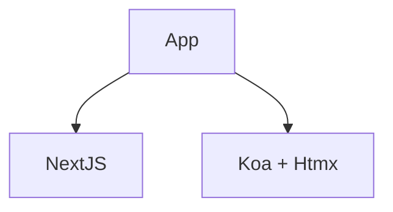

# What does the X stand for?

  <a href="https://github.com/flock-community/fullstack-web-study#readme" target="_blank" alt="GitHub" title="Open in GitHub"
    class="text-xl slidev-icon-btn opacity-50 !border-none !hover:text-white">
    <carbon-logo-github />
  </a>

---
layout: image
image: icons/web-foundations.png
---

---
layout: image
image: alexander-hafemann-M-EwSRl8BK8-unsplash.jpg
---

---
layout: cover
background: none
---

# Microblogging

---
layout: iframe
url: http://localhost:3001/
---

<!--
Chrome is not a browser!
Seeing intelligence in software is the new seeing Jesus in toast

-->

---
src: ./pages/htmx-index.md
---

---
src: ./pages/00-no-javascript.md
hide: false
---

---
src: ./pages/xx-sources.md
---
